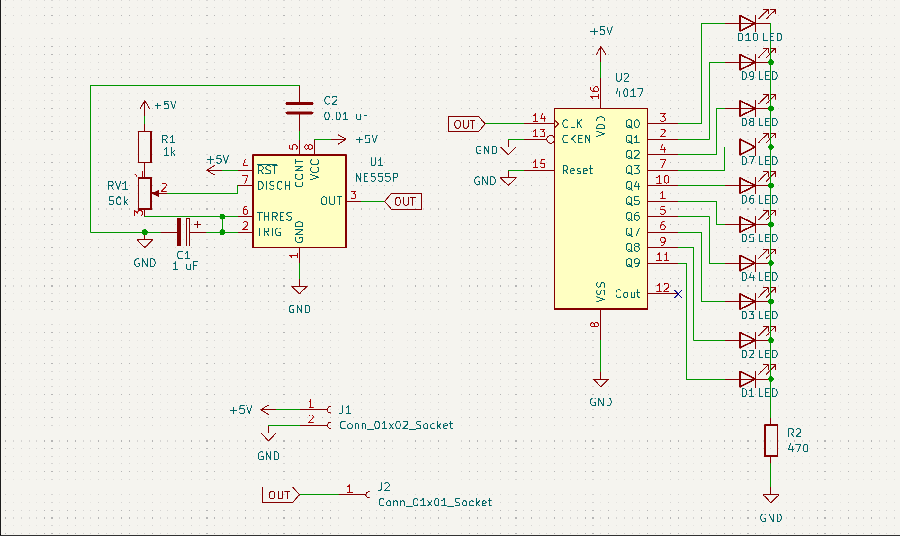
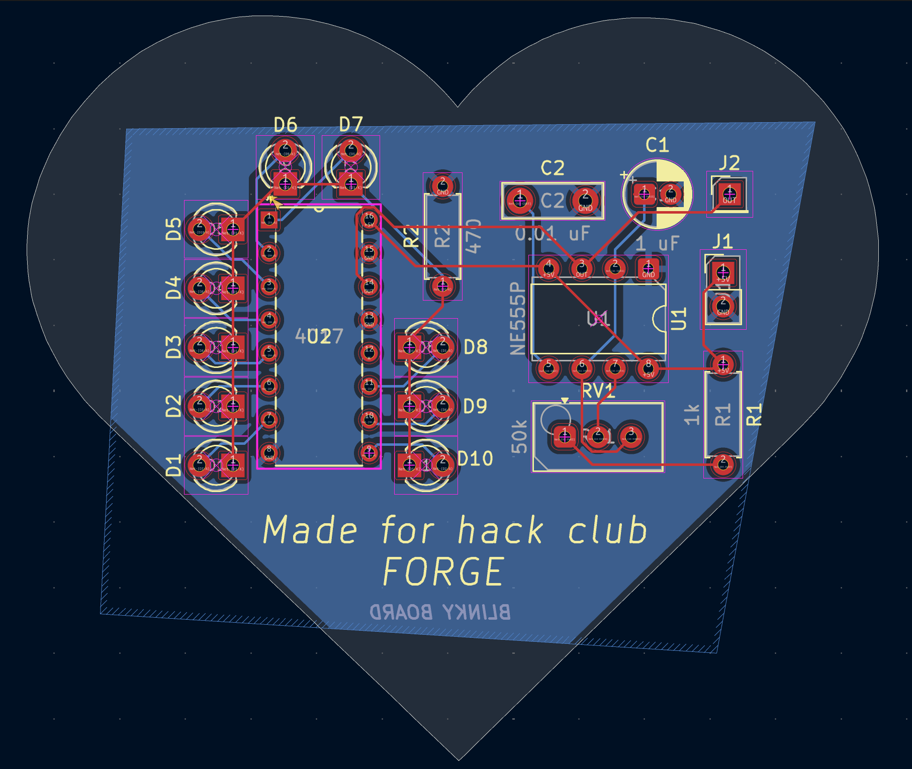
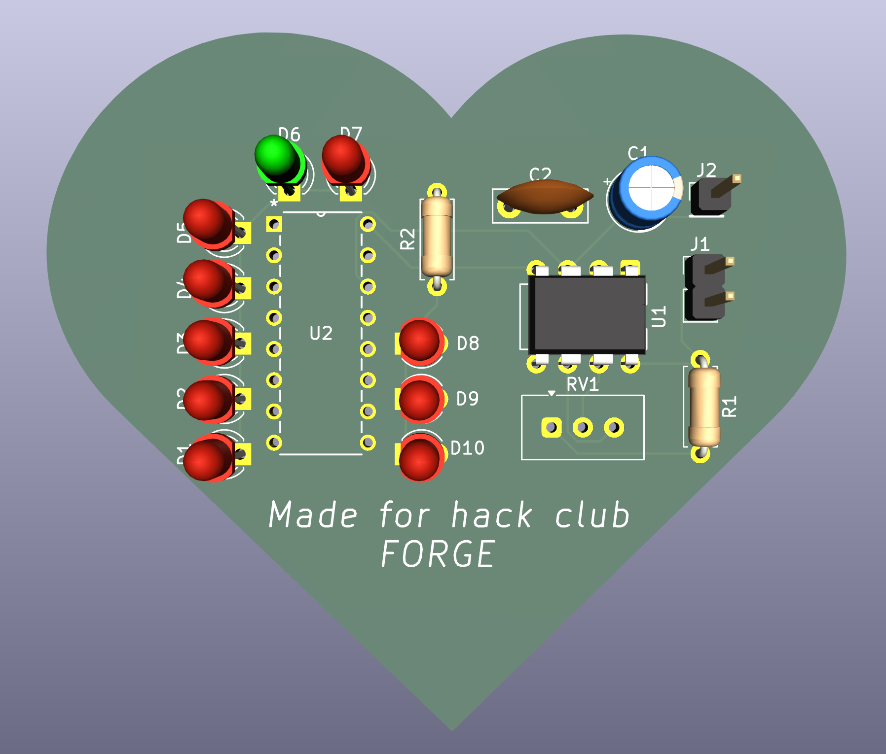
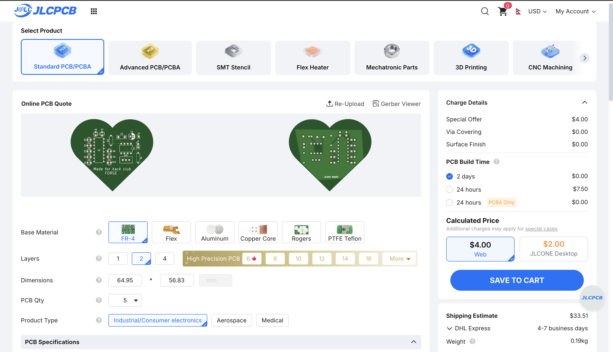

# LED Chaser (Blinky Board)

A 10-LED chaser board built with a 555 timer and CD4017 counter. My first PCB design, made through Hack Club's Forge program.

---

---

 

---

---

## What it does

10 LEDs light up in sequence, one after another, creating a chasing effect. There's a potentiometer (RV1) that lets you adjust the speed of the chase, turn it one way and it goes fast, the other way and it slows down.

## How to use

1. Power it with 5V via the J1 header (2-pin socket)
2. The LEDs (D1-D10) will start chasing in sequence
3. Twist RV1 to change the blink speed

Pretty simple honestly. Plug it in and watch it go.

## Why I made this

Wanted to get into hardware and PCB design. This was the perfect beginner project to learn KiCad, understand how oscillators and counters work, and actually ship something physical. Also the batman shaped board just looks cool lol.

## What I learned

- How a 555 timer works (astable mode generates a clock pulse)
- How a CD4017 decade counter distributes that pulse across 10 outputs
- Difference between SMD and THT components
- What global labels are and why power flags exist
- How to import custom footprints (CD4017 wasn't in KiCad by default)
- PCB routing is harder than it looks (redid mine twice)

---

# Bill of Materials (BOM)

**Project:** LED Chaser (Blinky Board)  
**Total Components:** 19  
**Estimated Total Cost:** $5.09 + 33 + 7 = 45$ (Including shipping and PCB)

| Ref | Qty | Value | Footprint | Links | Unit Price | Total |
|-----|-----|-------|-----------|-------|------------|-------|
| C1 | 1 | 1 µF | Capacitor_THT:CP_Radial_D5.0mm_P2.00mm | [LCSC C43342](https://www.lcsc.com/product-detail/C43342.html) / [LCSC C1579562](https://www.lcsc.com/product-detail/C1579562.html) | $0.14 | $0.14 |
| C2 | 1 | 0.01 µF | Capacitor_THT:C_Disc_D7.5mm_W2.5mm_P5.00mm | [LCSC C454399](https://www.lcsc.com/product-detail/C454399.html) | $0.17 | $0.17 |
| D1-D10 | 10 | LED | LED_THT:LED_D3.0mm | [LCSC C264302](https://www.lcsc.com/product-detail/C264302.html) / [LCSC C99771](https://www.lcsc.com/product-detail/C99771.html) | $0.10 | $1.00 |
| J1 | 1 | Conn_01x02_Socket | PinHeader_1x02_P2.54mm_Vertical | [DigiKey 929500-01-02-RK](https://www.digikey.com/en/products/result?keywords=929500-01-02-RK) | $0.10 | $0.10 |
| J2 | 1 | Conn_01x01_Socket | PinHeader_1x01_P2.54mm_Vertical | [DigiKey PRPC001DAAN-RC](https://www.digikey.com/en/products/result?keywords=PRPC001DAAN-RC) | $0.05 | $0.05 |
| R1 | 1 | 1kΩ | R_Axial_DIN0207_L6.3mm_D2.5mm_P7.62mm_Horizontal | [DigiKey CFR-25JR-52-1K](https://www.digikey.com/en/products/detail/yageo/CFR-25JR-52-1K/11974) | $0.05 | $0.05 |
| R2 | 1 | 470Ω | R_Axial_DIN0207_L6.3mm_D2.5mm_P7.62mm_Horizontal | [DigiKey CFR-25JR-52-470R](https://www.digikey.com/en/products/detail/yageo/CFR-25JR-52-470R/11966) | $0.05 | $0.05 |
| RV1 | 1 | 50kΩ | Potentiometer_Vishay_T93YA_Vertical | [LCSC C7061697](https://www.lcsc.com/product-detail/Trimmer-Potentiometers_VISHAY-T93YA503KT20_C7061697.html) / [DigiKey 3296W-1-503LF](https://www.digikey.co.uk/en/products/detail/bourns-inc/3296W-1-503LF/1088059) | $1.58 | $1.58 |
| U1 | 1 | NE555P | DIP-8_W7.62mm | [LCSC C46749](https://www.lcsc.com/product-detail/Timers-Clocks_NE555P_C46749.html) | $0.56 | $0.56 |
| U2 | 1 | CD4017BE | N16 (DIP-16) | [LCSC C34519](https://www.lcsc.com/product-detail/Counters-Dividers_TI-CD4017BE_C34519.html) | $1.39 | $1.39 |

---

---

## Cost Breakdown

| Part | Cost |
|------|------|
| Capacitors (C1, C2) | $0.31 |
| LEDs (x10) | ~$1.00 |
| Resistors (R1, R2) | $0.10 |
| Potentiometer (RV1) | $1.58 |
| NE555P (U1) | $0.56 |
| CD4017BE (U2) | $1.39 |
| Pin Headers (J1, J2) | $0.15 |
| **PCB (JLCPCB)** | ~$2.00 (for 5 boards) |
| **Total** | **~$7.34** |

> Note: The PCB cost isn't in the component BOM above because it's separate. Total project cost ends up around $7-10 depending on shipping and where you buy. Hack Club Forge covers this, so it's basically free for me lol.

---

## Credits

Built through [Hack Club's Forge](https://forge.hackclub.com) program. 
